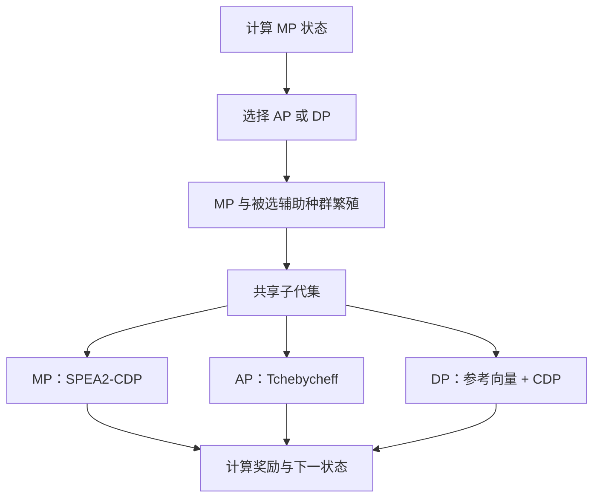

# CMODRLES：深度强化学习辅助的约束多目标辅助任务选择方法

> 本文档严格依据仓库 `main` 分支当前代码整理。对应代码快照：
> [`34ffe2adc9b42a0f7a07315196b108b23bb53fac`](https://github.com/Jie-10/CMODRLES/commit/34ffe2adc9b42a0f7a07315196b108b23bb53fac)，检索日期为 2026-09-19。
>
> 仓库中的 PlatEMO 算法类名为 `CMODRLES2`。本文统一将整个方法简称为 **CMODRLES**。

## 1. 方法概述

CMODRLES 面向约束多目标优化问题（constrained multi-objective optimization problems, CMOPs）。算法同时维护三个规模均为 $N$ 的种群：

| 种群 | 记号 | 是否考虑约束 | 核心筛选机制 | 主要职责 |
|---|---:|---:|---|---|
| 主种群 | MP | 是 | SPEA2-CDP | 面向可行域和约束 Pareto 前沿进行搜索 |
| 收敛辅助种群 | AP | 否 | 基于权重向量的 Tchebycheff | 从不同目标方向推动无约束收敛 |
| 多样性种群 | DP | 是 | 参考向量分区 + SPEA2-CDP | 维持目标空间方向覆盖与可行搜索能力 |

深度学习模块不改变三个种群各自的环境选择规则，而是在每一代从 AP 和 DP 中选择一个辅助种群参与繁殖。MP 始终参与繁殖；MP 与被选中的辅助种群各产生 $N$ 个子代，组成共享子代集。随后，三个种群均使用这批共享子代更新，因此未被选择的辅助种群当代虽然不产生子代，但并未冻结。



## 2. 符号定义

| 符号 | 含义 |
|---|---|
| $M$ | 目标数 |
| $D$ | 决策变量维数 |
| $N$ | 每个种群的规模 |
| $K$ | 权重向量数，代码中要求 AP 更新时 $K=N$ |
| $\mathbf{f}(x)$ | 解 $x$ 的目标向量 |
| $\mathbf{c}(x)$ | 解 $x$ 的约束向量，$c_j(x)\le 0$ 表示满足第 $j$ 个约束 |
| $\mathbf{w}_i$ | 第 $i$ 个权重向量 |
| $\mathbf{z}^{*}$ | AP 使用的理想点 |
| $P_M,P_A,P_D$ | MP、AP、DP |
| $O_M,O_A,O_D$ | MP、AP、DP 产生的子代，其中每代只会产生 $O_A$ 或 $O_D$ 之一 |

## 3. 初始化

算法首先由 PlatEMO 生成一个初始种群，然后将其复制为 MP、AP 和 DP：

$$
P_M^{0}=P_A^{0}=P_D^{0}.
$$

权重向量通过下式生成：

```matlab
[W,~] = UniformPoint(N,Problem.M,'MUD');
```

AP 的初始理想点为：

$$
z_j^{*}=\min_{x\in P_A^0} f_j(x),\qquad j=1,\ldots,M.
$$

每个 AP 子代最多替换的子问题数设为：

$$
n_r=2.
$$

### 3.1 参考向量角度阈值

令两个权重向量之间的夹角为：

$$
\theta_{ij}=\arccos\left(
\frac{\mathbf{w}_i^{\mathsf{T}}\mathbf{w}_j}
{\|\mathbf{w}_i\|_2\|\mathbf{w}_j\|_2}
\right).
$$

DP 使用的子空间角度阈值为：

$$
\theta_{\min}
=\frac{1}{2K}\sum_{i=1}^{K}\min_{j\ne i}\theta_{ij}.
$$

当仅有一个权重向量时，代码令 $\theta_{\min}=\pi/2$。

## 4. 通用适应度：SPEA2-CDP

MP 与 DP 使用考虑约束的 `CalFitness`；AP 环境选择不使用该适应度，但会在更新后计算无约束适应度供交配选择使用。

### 4.1 总体约束违反度

对解 $x_i$，总体约束违反度定义为：

$$
CV_i=\sum_{j}\max\bigl(0,c_j(x_i)\bigr).
$$

仓库当前所有约束感知调用均令 $\varepsilon=0$。

### 4.2 CDP 支配关系

代码中的约束支配关系可写为：解 $x_i$ 支配 $x_j$，当且仅当满足以下任一条件：

1. $CV_i<CV_j$；
2. $CV_i=CV_j$，且 $x_i$ Pareto 支配 $x_j$。

因此，可行解优于不可行解；两个不可行解优先比较总体约束违反度；当违反度相同时再比较目标支配关系。

若 `CalFitness` 仅接收目标矩阵，则所有解的 $CV$ 被置为 0，适应度退化为无约束 SPEA2 适应度。

### 4.3 强度、原始适应度与密度

令 $x_i\succ x_j$ 表示上述支配关系。个体 $i$ 的支配强度为：

$$
S_i=\left|\{j\mid x_i\succ x_j\}\right|.
$$

原始适应度为所有支配者强度之和：

$$
R_i=\sum_{j:x_j\succ x_i}S_j.
$$

令 $\sigma_i^{(k)}$ 为个体 $i$ 到第 $k$ 个近邻的目标空间欧氏距离，其中：

$$
k=\left\lfloor\sqrt{n}\right\rfloor,
$$

$n$ 为当前候选集规模。密度项为：

$$
D_i=\frac{1}{\sigma_i^{(k)}+2}.
$$

最终适应度为：

$$
F_i=R_i+D_i.
$$

**适应度越小越好。** 由于 $0<D_i\le 0.5$，代码中的 $F_i<1$ 对应 $R_i=0$ 的非支配个体。

## 5. 三个种群的环境选择

### 5.1 MP：SPEA2-CDP 环境选择

每代共享子代集为：

$$
O_S=O_M\cup O_{a},\qquad
a\in\{A,D\},
$$

其中 $|O_M|=|O_a|=N$，所以 $|O_S|=2N$。MP 的候选集为：

$$
C_M=P_M\cup O_S,\qquad |C_M|=3N.
$$

MP 的筛选过程如下：

1. 使用 SPEA2-CDP 计算 $C_M$ 中所有个体的适应度；
2. 首先保留所有 $F_i<1$ 的个体；
3. 若保留数少于 $N$，按 $F_i$ 从小到大补足；
4. 若保留数超过 $N$，使用 SPEA2 截断操作反复删除最拥挤个体；
5. 将最终个体按适应度升序排列，并同步保留其在 $C_M$ 中的原始索引。

截断操作对每个候选个体的全部近邻距离进行升序排列，再以距离序列的字典序识别最拥挤个体并删除，直至剩余 $N$ 个个体。

### 5.2 AP：无约束 Tchebycheff 替换

AP 中第 $i$ 个位置与权重向量 $\mathbf{w}_i$ 一一对应。AP 完全忽略约束，并采用除法形式的 Tchebycheff 标量函数：

$$
g(x\mid \mathbf{w}_i,\mathbf{z}^{*})
=\max_{1\le j\le M}
\frac{|f_j(x)-z_j^{*}|}{\max(w_{ij},10^{-6})}.
$$

共享子代中的每个解 $y\in O_S$ 按顺序执行以下操作：

**1. 更新理想点：**\
$$z_j^{\ast}\leftarrow\min\left(z_j^{\ast},f_j(y)\right).$$

**2. 随机打乱全部 $N$ 个子问题的检查顺序；**

**3. 对每个位置 $i$ 比较：**\
$$g(y\mid\mathbf{w}_i,\mathbf{z}^{\ast})\leq g(x_i\mid\mathbf{w}_i,\mathbf{z}^{\ast}).$$

**4. 从满足条件的位置中，按照随机检查顺序最多替换 $n_r=2$ 个。**

因此，权重向量负责区分目标搜索方向，Tchebycheff 值负责推动对应方向上的收敛。所有共享子代均可尝试更新 AP，无论该代被强化学习选中的是 AP 还是 DP。

AP 更新结束后再计算：

$$
F_i^{A}=R_i+D_i,
$$

该无约束 SPEA2 适应度**只用于下一代的锦标赛交配选择，不参与 AP 环境替换**。

### 5.3 DP：参考向量分区与 SPEA2-CDP

DP 的候选集为：

$$
C_D=P_D\cup O_S,\qquad |C_D|=3N.
$$

对候选解 $x_q$ 与权重向量 $\mathbf{w}_i$，代码使用原始目标向量相对于坐标原点的夹角：

$$
\theta_{qi}=\arccos\left(
\frac{\mathbf{f}(x_q)^{\mathsf{T}}\mathbf{w}_i}
{\|\mathbf{f}(x_q)\|_2\|\mathbf{w}_i\|_2}
\right).
$$

若余弦距离计算产生 `NaN`，代码令对应夹角为 $\pi/2$。候选解属于参考向量 $i$ 的子空间，当：

$$
\theta_{qi}\le\theta_{\min}.
$$

DP 的选择分为两步。

**步骤：逐参考向量保留一个解**

- 若当前子空间包含尚未选择的解，则选择其中 SPEA2-CDP 适应度最小者；
- 若当前子空间为空，则从全部剩余解中选择与当前参考向量夹角最小者；
- 每个解最多选择一次；达到 $N$ 个解时停止。

## 6. 交配选择与子代生成

### 6.1 辅助种群选择

动作 $a_t$ 决定当代参与繁殖的辅助种群：

$$
a_t=
\begin{cases}
1,&\text{选择 AP},\\
2,&\text{选择 DP}.
\end{cases}
$$

在代码中：

```matlab
auxIndex = action + 1;
```

所以 `Population{2}` 对应 AP，`Population{3}` 对应 DP。

### 6.2 父代选择

MP 和被选中的辅助种群分别依据自身适应度执行二元锦标赛选择：

```matlab
MatingPool1 = TournamentSelection(2,N,Fitness{1});
MatingPool2 = TournamentSelection(2,N,Fitness{auxIndex});
```

每一代只随机一次决定繁殖方式，因此 MP 与被选辅助种群在该代使用相同类型的繁殖机制：

- 以 0.5 概率使用邻域配对 + `OperatorGAhalf`；
- 以 0.5 概率使用 `OperatorDE`。

### 6.3 邻域配对策略

首先由三个种群的目标值共同确定当前理想参考点：

$$
z_j^{\min}=\min_{x\in P_M\cup P_A\cup P_D} f_j(x).
$$

对已由锦标赛选出的父代 $x$，构造归一化目标方向：

$$
\mathbf{u}(x)=
\frac{\mathbf{f}(x)-\mathbf{z}^{\min}}
{\max(\|\mathbf{f}(x)-\mathbf{z}^{\min}\|_2,10^{-12})}.
$$

利用余弦相似度：

$$
\mathrm{sim}(x,y)=\mathbf{u}(x)^{\mathsf{T}}\mathbf{u}(y),
$$

在本种群中找出与父代目标方向最接近的 $N_r$ 个个体，其中：

$$
N_r=\min(10,N).
$$

再从这 $N_r$ 个邻居中均匀随机选择第二个父代，并使用 `OperatorGAhalf` 产生子代。每个种群的邻域和第二父代均仅来自该种群自身。

### 6.4 DE 分支

DE 分支采用当前种群、该种群的一个随机排列和另一个独立随机排列作为输入：

```matlab
OperatorDE(Problem,Population,...
           Population(randperm(N)),...
           Population(randperm(N)))
```

因此，当前代码虽然在进入分支前计算了锦标赛交配池，但 DE 分支实际直接使用完整种群及其随机排列，未使用 `MatingPool1` 或 `MatingPool2`。

## 7. 强化学习状态、动作与奖励

### 7.1 状态：可行性与方向收敛状态

状态只由 MP 计算：

$$
\mathbf{s}_t=[s_t^{CV},s_t^{TCH}].
$$

#### 状态 1：MP 的平均总体约束违反度

$$
s_t^{CV}=\frac{1}{N}\sum_{x\in P_M^t}CV(x).
$$

该值越小，表示 MP 整体越接近可行域；当 MP 全部可行时，该状态量为 0。

#### 状态 2：基于参考向量的 Tchebycheff 集合指标

代码维护所有已观察目标值的逐维下界 $\mathbf{L}_t$ 和上界 $\mathbf{U}_t$。初始化时使用初始 MP 与 AP；之后每代仅用新生成的共享子代更新：

$$
L_{t,j}=\min(L_{t-1,j},\min_{x\in O_S^t}f_j(x)),
$$

$$
U_{t,j}=\max(U_{t-1,j},\max_{x\in O_S^t}f_j(x)).
$$

为避免零跨度，初始化时定义：

$$
\eta_j=10^{-12}\max\left(1,\max_{x\in P_M^0\cup P_A^0}|f_j(x)|\right).
$$

MP 个体的归一化目标为：

$$
\widetilde{f}_j(x)=
\left|
\frac{f_j(x)-L_{t,j}}
{\max(U_{t,j}-L_{t,j},\eta_j)}
\right|.
$$

对每个参考向量 $\mathbf{w}_i$，计算 MP 在该方向上的最佳除法式 Tchebycheff 值：

$$
v_i^t=
\min_{x\in P_M^t}
\max_{1\le j\le M}
\frac{\widetilde{f}_j(x)}{\max(w_{ij},10^{-6})}.
$$

第二个状态量为全部方向的均值：

$$
s_t^{TCH}=\frac{1}{K}\sum_{i=1}^{K}v_i^t.
$$

该值越小，表示 MP 在各参考方向上总体更接近动态观测下界。它同时包含方向覆盖与收敛信息，但不是传统 IGD、HV 或单个个体的 Tchebycheff 值。

### 7.2 动作：在 AP 与 DP 之间分配繁殖资源

动作空间为：

$$
\mathcal{A}=\{1,2\}=\{\text{AP},\text{DP}\}.
$$

- MP 每代固定产生 $N$ 个子代；
- 被选中的辅助种群产生 $N$ 个子代；
- 未被选中的辅助种群不产生子代，但仍利用全部共享子代执行环境更新。

前 200 个决策代均匀随机选择动作。此后，代码以 `greedy = 0.95` 执行 $\varepsilon$-greedy 决策：

$$
a_t=
\begin{cases}
\arg\max_{a\in\{1,2\}}\widehat{q}(\mathbf{s}_t,a),&p=0.95,\\
\mathrm{Uniform}\{1,2\},&p=0.05.
\end{cases}
$$

由于随机分支也可能抽中当前最优动作，当两个预测值不相等时，预测最优动作的实际总概率为 0.975，另一个动作的概率为 0.025。

### 7.3 奖励：辅助子代对 MP 的新颖存活贡献率

MP 候选集的固定排列为：

$$
C_M=[P_M,O_M,O_a].
$$

其索引区间分别是：

$$
P_M:1\ldots N,
\quad O_M:N+1\ldots 2N,
\quad O_a:2N+1\ldots 3N.
$$

设 MP 环境选择后的原始候选索引集合为 $I_t$。首先找出存活的辅助子代：

$$
I_t^a=\{i\in I_t\mid i\ge 2N+1\}.
$$

然后执行两层去重：

1. 若某个存活辅助子代的决策向量与 $P_M\cup O_M$ 中任一决策向量完全相同，则不计入奖励；
2. 多个存活辅助子代具有相同决策向量时，只计一次。

令 $U_t^a$ 表示经过上述处理后的新颖、唯一且在 MP 中存活的辅助子代集合，则奖励为：

$$
r_t=\frac{|U_t^a|}{N},\qquad 0\le r_t\le 1.
$$

分母始终是该代实际评估的全部 $N$ 个辅助子代，而不是存活辅助子代数。因此，该奖励衡量的是：

> 被选辅助任务产生的全部子代中，有多大比例以新颖决策向量的形式通过 MP 的 SPEA2-CDP 环境选择。

奖励没有显式要求辅助子代可行或非支配，但 MP 的约束感知环境选择会间接影响其能否存活。

## 8. 当前代码中的神经网络与经验更新

本节只描述仓库当前实现，不将其等同于标准 DQN。

### 8.1 经验格式与回放池

每条经验记录为：

$$
e_t=[s_t^{CV},s_t^{TCH},a_t,r_t,s_{t+1}^{CV},s_{t+1}^{TCH}].
$$

回放池最多保存最近 500 条经验；超过容量后删除最早的一条，即采用 FIFO 策略。

### 8.2 首次建模

在第 200 个随机决策阶段结束后，代码随机抽取 200 条经验，以：

$$
\mathbf{x}_t=[s_t^{CV},s_t^{TCH},a_t]
$$

作为三维输入，并以：

$$
\mathbf{y}_t=[r_t,s_{t+1}^{CV},s_{t+1}^{TCH}]
$$

作为三维监督目标。输入与输出分别通过 `mapminmax` 归一化。

网络结构为：

$$
3\rightarrow40\rightarrow40\rightarrow3,
$$

其中第一隐藏层使用 ReLU，第二隐藏层实际使用 `tanh`，输出层为线性层。训练代码设置输入 dropout 为 0.2、隐藏层 dropout 为 0.5、学习率为 0.01、权重衰减为 $10^{-5}$，首次训练迭代 80000 次。

动作选择只使用网络输出的第一维：

$$
\widehat{q}(\mathbf{s}_t,a)
=\widehat{y}_1([\mathbf{s}_t,a]),
$$

即将预测的即时奖励分量作为动作评分；预测的两个下一状态分量不直接参与动作选择。

### 8.3 后续网络更新

网络建立后，代码在 `count > 50` 时更新一次，即实际每 51 个循环触发一次。每次从回放池随机抽取 200 条经验。

按当前源码，先计算样本当前输入的第一维网络输出：

$$
\widehat{r}_i=\widehat{y}_1([\mathbf{s}_i,a_i]).
$$

再取整个训练批次中的全局最大预测值：

$$
b=\max_i\widehat{r}_i.
$$

随后为每条样本构造：

$$
y_i^{\mathrm{update}}=r_i+\gamma b,
\qquad \gamma=0.9.
$$

该标量目标经 `mapminmax` 重新归一化后用于 8000 次增量训练。

## 9. 单代完整流程

```text
输入：MP、AP、DP、经验池、网络、动态目标范围

1. 由 MP 计算状态 s_t = [平均 CV，平均参考向量 Tchebycheff 指标]
2. 前 200 个决策代随机选择 AP/DP；之后由网络执行 ε-greedy 选择
3. MP 与被选辅助种群分别进行二元锦标赛选择
4. 以 0.5 概率统一使用邻域配对 + GA，否则统一使用 DE
5. MP 产生 N 个子代，被选辅助种群产生 N 个子代
6. 合并得到共享子代 O_S
7. MP 在 P_M ∪ O_S 上执行 SPEA2-CDP
8. AP 逐个读取 O_S，并执行无约束 Tchebycheff 替换
9. DP 在 P_D ∪ O_S 上执行参考向量分区 + SPEA2-CDP
10. 用 O_S 更新动态目标范围，并由新 MP 计算下一状态 s_{t+1}
11. 根据辅助子代在 MP 中的新颖存活比例计算奖励 r_t
12. 保存 [s_t,a_t,r_t,s_{t+1}]；必要时训练或更新网络
```

## 10. 关键参数

| 参数 | 当前值 | 代码含义 |
|---|---:|---|
| 动作数 | 2 | AP 或 DP |
| 随机探索期 | 200 个决策代 | 期间均匀随机选择辅助种群 |
| `greedy` | 0.95 | 建模后的贪婪分支概率 |
| `gama` | 0.9 | 当前增量目标中的折扣系数 |
| 回放池容量 | 500 | 保存最近经验 |
| 训练抽样数 | 200 | 首次训练及增量更新均使用 200 条经验 |
| 网络更新间隔 | `count > 50` | 实际每 51 个循环更新 |
| AP 最大替换数 $n_r$ | 2 | 每个共享子代最多替换两个 AP 位置 |
| 邻居数 $N_r$ | $\min(10,N)$ | 邻域配对的候选邻居数 |
| GA/DE 选择概率 | 0.5/0.5 | 两个繁殖种群当代使用同一分支 |
| 隐藏层规模 | 40、40 | ReLU + tanh |
| dropout | 0.2、0.5 | 输入层与第一隐藏层之后 |
| 学习率 | 0.01 | 自定义梯度下降 |
| 权重衰减 | $10^{-5}$ | 网络权重正则项 |
| 首次训练迭代数 | 80000 | `trainmodel.m` |
| 增量训练迭代数 | 8000 | `updatemodel.m` |

主循环中的代数近似量按下式计算：

$$
\text{gen}=\left\lceil\frac{FE}{2N}\right\rceil,
$$

因为常规循环中 MP 和一个辅助种群合计产生约 $2N$ 个新解。

## 11. 文件与功能对应关系

| 文件 | 功能 |
|---|---|
| `CMODRLES2.m` | 三种群主循环、动作选择、经验回放与网络调度 |
| `CMODRLES_State.m` | 计算平均 CV 与参考向量 Tchebycheff 状态 |
| `CMODRLES_Reward.m` | 计算辅助子代对 MP 的新颖存活贡献率 |
| `CalFitness.m` | SPEA2 或 SPEA2-CDP 适应度 |
| `EnviromentSelect1.m` | MP 的 SPEA2-CDP 环境选择 |
| `EnviromentSelect2.m` | AP 的 Tchebycheff 顺序替换 |
| `EnviromentSelect3.m` | DP 的参考向量分区与 SPEA2-CDP 选择 |
| `Neighbor_Pairing_Strategy.m` | 基于目标方向相似度的种群内邻域配对 |
| `Dropout/trainmodel.m` | 初始化并首次训练神经网络 |
| `Dropout/updatemodel.m` | 增量更新神经网络 |
| `Dropout/trainNet.m` | 前向传播、反向传播与参数更新 |
| `Dropout/testNet.m` | 网络预测 |
| `Dropout/dropout.m` | dropout 掩码操作 |
| `Dropout/iniA.m` | 网络权重和偏置初始化 |
| `Dropout/Estimate.m` | 基于多次随机预测估计均值与标准差；当前主循环未调用 |
| `Dropout/MgaussRandom.m` | 高斯随机数辅助函数；当前主循环未直接调用 |

## 12. 当前实现边界与注意事项

以下结论来自当前仓库源码，理解或描述该方法时不应忽略。

### 12.1 当前实现不是标准 DQN

标准 DQN 通常按每条经验计算：

$$
y_i=r_i+\gamma\max_{a'}Q_{\theta^-}(s_i',a'),
$$

并具有在线网络、目标网络和基于下一状态的逐样本 TD 目标。当前仓库没有目标网络，增量更新也没有将 $s_{t+1}$ 输入网络，而是使用当前批次预测即时奖励的全局最大值。因此，准确表述应是：

> 使用带 dropout 的神经网络对“状态—辅助任务”组合进行评分，并据此自适应选择辅助任务。

在修正更新机制前，不宜将当前实现直接称为“标准 DQN”。

### 12.2 首次训练与增量更新的输出维度不一致

首次建模时网络输出维数为 3，对应 $[r_t,s_{t+1}^{CV},s_{t+1}^{TCH}]$；增量更新时 `tr_yy` 变为单列标量目标。网络输出层仍有 3 个节点，`trainNet` 中可能通过 MATLAB 隐式扩展将同一标量目标施加到三个输出节点。同时，`Params.qs` 会从三维输出的归一化设置被覆盖为一维设置，后续对三维网络输出执行反归一化存在维度不一致风险。

### 12.3 推理阶段仍启用 dropout

`testNet.m` 在动作评分时仍调用 `dropout`，没有切换到确定性推理模式。因此，同一状态—动作输入的预测值可能随随机掩码变化。该实现更接近 Monte Carlo dropout 式随机预测，但主循环每个动作只预测一次，并未使用 `Estimate.m` 中的多次预测均值与方差。

### 12.4 AP 的主循环注释已过时

`CMODRLES2.m` 将 AP 注释为 “diversity-oriented SPEA2 without constraints”，但实际调用的 `EnviromentSelect2.m` 已采用无约束 Tchebycheff 顺序替换。无约束 SPEA2 适应度仅在 AP 更新后计算并用于交配选择。因此，按当前实际机制，AP 更适合称为：

> **基于分解的无约束收敛辅助种群。**

### 12.5 奖励依赖候选集固定顺序

奖励函数通过索引区间识别辅助子代，因而依赖：

```matlab
CandidateMP = [Population{1},Offspring{1},Offspring{2}];
```

以及 `nParent=nMP=nAux=N`。若后续调整候选集顺序或不同来源的子代数量，必须同步修改奖励索引逻辑。

### 12.6 未被选择的辅助种群并未停止进化

动作只控制 AP 或 DP **谁产生子代**，不控制谁接受共享知识。无论动作取值如何，AP 和 DP 每代都会接收 $O_M\cup O_a$ 并执行各自的环境更新。因此，当前动作的准确含义是：

> 在 AP 与 DP 之间分配当代的辅助繁殖/函数评估资源，而不是启用或关闭某个辅助种群。

## 13. 方法定位

CMODRLES 当前代码的完整决策链为：

$$
\boxed{
\text{MP 搜索状态}
\rightarrow
\text{选择 AP 或 DP 参与繁殖}
\rightarrow
\text{共享子代更新三个种群}
\rightarrow
\text{辅助子代对 MP 的新颖存活贡献}
}
$$

其核心不在于自适应选择 GA 或 DE，而在于根据 MP 的可行性与方向收敛状态，在功能不同的 AP 和 DP 之间动态分配辅助繁殖资源。三个种群保持固定、互补的环境选择机制，强化学习模块仅负责辅助任务选择与资源调度。
